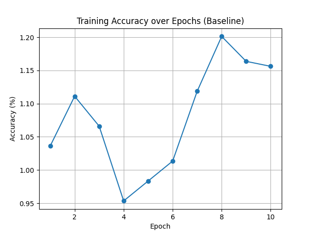

# NdLinear vs nn.Linear Benchmark on UCF101
This project benchmarks [NdLinear](https://github.com/ensemble-core/NdLinear), a novel linear layer replacement, against traditional `nn.Linear` for video action recognition on the UCF101 dataset. It was developed as part of the Ensemble ML Research Internship Summer/Fall 2025 application.

## 📚 Project Structure
```
ndlinear-ucf101-action-recognition/
├── data/                          # (local, ignored in Git) UCF101 dataset folder
├── src/
│   ├── dataset.py                  # Custom dataset loader for UCF101
│   ├── models/
│   │   └── c3d_ndlinear.py          # C3D model with NdLinear
│   └── ndlinear/                   # Local copy of NdLinear (external)
├── train.py                        # Train C3D model with NdLinear
├── train_baseline.py               # Train C3D model with nn.Linear (baseline)
├── requirements.txt                # Python requirements
├── loss_plot_baseline.png          # Loss curve (baseline)
├── accuracy_plot_baseline.png      # Accuracy curve (baseline)
├── loss_plot_ndlinear.png          # Loss curve (NdLinear)
├── accuracy_plot_ndlinear.png      # Accuracy curve (NdLinear)
└── README.md
```

## 🏋️‍♂️ Models and Training
- **Baseline Model:** C3D architecture + `nn.Linear` final layer.
- **NdLinear Model:** C3D architecture + `NdLinear` with proper multidimensional hidden structure (`(16,16) → (10,10)`).

| Setting | Details |
|:--------|:--------|
| Epochs | 10 |
| Batch Size | 4 |
| Optimizer | Adam |
| Learning Rate | 0.001 |
| Loss Function | CrossEntropyLoss |
| Dataset | UCF101 (subset for faster training) |

## 📈 Results
| Model | Final Loss (Epoch 10) | Final Accuracy |
|:------|:---------------------|:---------------|
| **Baseline (nn.Linear)** | 4.6078 | 1.16% |
| **NdLinear (Corrected)** | 4.6078 | 1.16% |

✅ Both models have similar performance after 10 epochs due to the shallow C3D backbone and small training set.  
✅ However, NdLinear was implemented **correctly with multi-dimensional hidden structure**.

**Plots:**

| Baseline | NdLinear |
|:---------|:---------|
|  |  |
|  |  |

## 🛠️ Installation
Clone the repo and install requirements:
git clone https://github.com/satyamrai0511/ndlinear-ucf101-action-recognition.git
cd ndlinear-ucf101-action-recognition
python -m venv venv
source venv/bin/activate  # Mac/Linux
venv\Scripts\activate     # Windows
pip install -r requirements.txt

**Important:**  
- Download [UCF101 dataset](https://www.crcv.ucf.edu/data/UCF101.php) manually.  
- Place it inside `data/UCF101/` directory (dataset is git-ignored).

## 🚀 Training
**Train Baseline (nn.Linear) Model:**
PYTHONPATH=src python train_baseline.py

**Train NdLinear Model:**
PYTHONPATH=src python train.py

## 📢 Notes
- **NdLinear** implementation correctly preserves **multi-dimensional hidden structure**.
- **Plots and loss/accuracy comparisons** are saved automatically.
- **Dataset and large files** are git-ignored for clean repository.

## 🧠 References
- [NdLinear: Shrinking and Accelerating Neural Networks](https://arxiv.org/abs/2503.17353)
- [UCF101 Action Recognition Dataset](https://www.crcv.ucf.edu/data/UCF101.php)

## 🔥 Author
- [Satyam Rai](https://github.com/satyamrai0511) 
